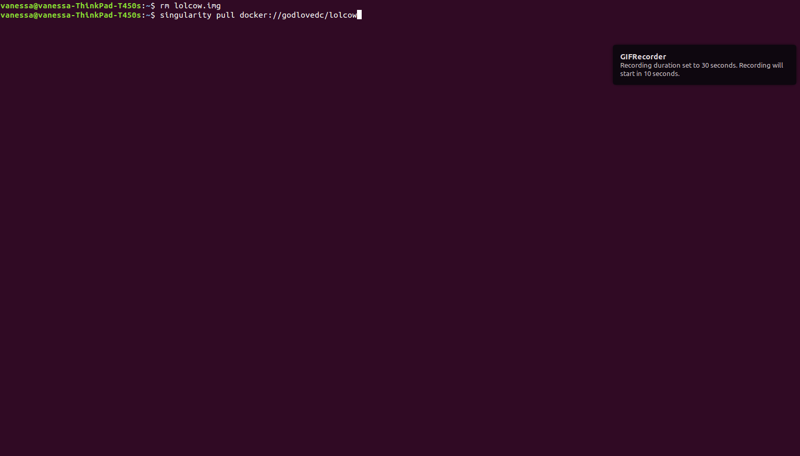
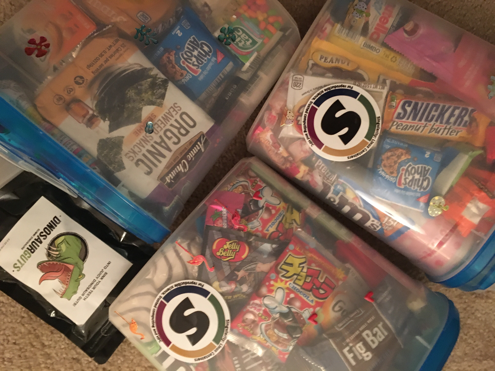
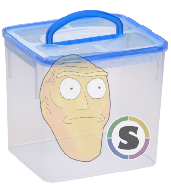

# Show Me What You Got!

Congratulations to our winner [David Godlove](https://github.com/GodloveD) for his `lolcow`, who presented a simple container that fit the spirit of the competition perfectly! Shout outs to Stefan Kombrink for a close second place with his [multinode ssh wrapper](https://singularity-hub.org/demos/6/). And here we have, `lolcow` in all its glory!



Want to play with the `lolcow`? It works in a single command! You can use Docker or Singularity, give this a whirl:

```
singularity run docker://godlovedc/lolcow
Docker image path: index.docker.io/godlovedc/lolcow:latest
Cache folder set to /home/vanessa/.singularity/docker
Creating container runtime...
 _________________________________________
/ Always do right. This will gratify some \
| people and astonish the rest.           |
|                                         |
\ -- Mark Twain                           /
 -----------------------------------------
        \   ^__^
         \  (oo)\_______
            (__)\       )\/\
                ||----w |
                ||     ||
```

or better yet, pull it to you computer so you can have the lolcow in all it's glory!

```
./lolcow.img 
 _____________________________________
/ Someone whom you reject today, will \
\ reject you tomorrow.                /
 -------------------------------------
        \   ^__^
         \  (oo)\_______
            (__)\       )\/\
                ||----w |
                ||     ||
```

You can also run directly with docker, but you won't get any color output:

```
docker run godlovedc/lolcow
```

Everyone will be a little happier with an lolcow in their life, for messages of wisdom on demand! Congratulations to Dave, he (and his kids will be appreciative) will be receiving some glorious container snacks.




# Competition Announcement



We are announcing our first competition, starting now! And it's a simple task. You must create a [Singularity](http://singularity.lbl.gov) container that is cool, interesting, innovative, or fun. That's it! The prizes are awesome, and we encourage all container expertise (new and old!) to enter.

## Who can enter?
The prizes will be awarded in person at the [PEARC 2017 conference](https://www.pearc17.pearc.org/) in New Orleans, specifically during the [Reproducibility and Containers](https://www.pearc17.pearc.org/speakers) talk, so if you are going to be in attendance, great! If not, no worries - you can either have a representative collect your prize for you (most big centers will be going) or we will send you your prize (please, contintental US only). Anyone and everyone is eligible to enter, and you can submit as many containers as you like.


## How do I enter?

 1. First, add your container to build on [Singularity Hub](https://www.singularity-hub.org). We do this so that all users will be using the same build environments, and a link to their container will also link to the build specification file and Github repo.
 2. When you are content with your container, [fill out this form](https://goo.gl/forms/5SNWnGbUpBAjVneq1) to enter the competition. If you cannot attend, be sure to give us the contact for someone in attendence to claim your prize. If you are not in attendance, we will still show your container to an audience of over > 100 people.
 3. The deadline for entering containers is **midnight PST on Thursday, July 6th** (yes we have extended due to the holiday!).


## How does it work?

We are looking for fun, interesting, or innovative ways to use containers. Silly or surprising is good too. Basically, you have creative freedom to do most things that you can dream up! The criteria are as follows:

 - Your container must not require any additional configuration, setup, or special resources. If you need to provide us with special instructions for running (e.g., binding folders, customizing arguments) then you should provide this in the README of the Github repository associated with the container.
 - Containers that do anything malicious will be disqualified.
 - Containers should be no larger than 8000MB.


The judges will be the speakers for the talk at PEARC ([@vsoch](https://www.github.com/vsoch) and [@gmkurtzer](https://www.github.com/gmkurtzer)), and we will choose one or more winners, depending on how many entries we get. If you have absolutely any questions, please [post an issue](https://www.github.com/containers-ftw/containers-ftw.github.io/issues). 

So what are you waiting for? **Show me what you got!**
